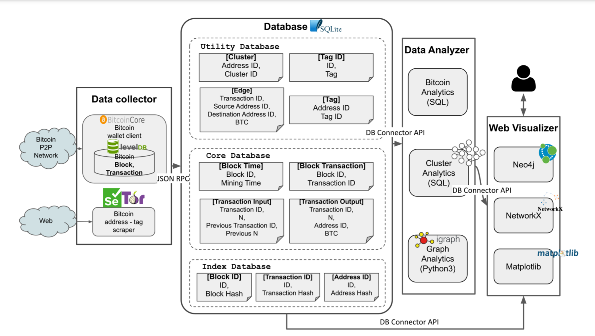

# System

### 1. 프로그램 아키텍처 

1. 데이터 수집기: 원천데이터수집 및 가공
   * Bitcoin P2P 네트워크로부터 비트코인 트랜잭션 수집
   * 표면웹과 딥웹으로부터 비트코인 주소와 비트코인 주소를 보이는 웹사이트 수집
2. 데이터 베이스:가공된 데이터 베이스 저
   * Core Database: 블록체인 비트코인들의 실제 값을 가지고 있는 부분 가지고 있는 부분
   * Index Database: 실제값을 가리키는 인덱스를 저장하고 있는 부분
   * Utility Database: 분석을 위해 가지고 있는 데이터베이스
3. 데이터 분석기
   * 비트코인 
   * 그래프 분석
   * 클러스터 분석
4. 웹 시각화
   1. Neo4j: 비트코인 그래프 분석기\(대용량\)
   2. NetworkX: 비트코인 클러스터 분석기\(소규모용량\)
   3. Matplotlib: 시간분석

